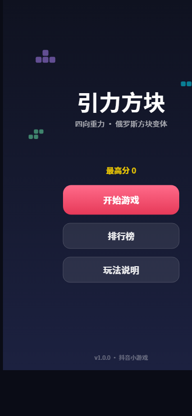
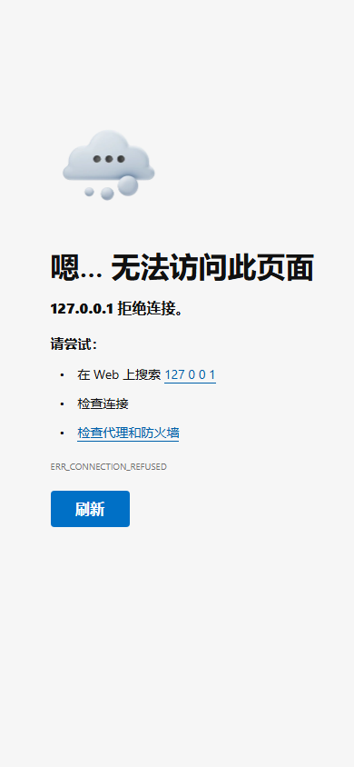
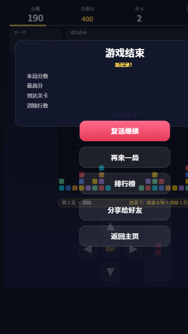

# 引力方块（dygame-cube）

一款抖音小游戏：四向重力方块消除玩法（合规文案，对外物料统一使用「方块消除玩法」表述）。

## 玩法特色

- **中心生成**：方块从 20×20 棋盘正中心生成，而非传统的顶部
- **随机重力**：每个方块的下落方向随机（下 / 左 / 上 / 右），重力侧的棋盘边缘会高亮显示
- **下落前提示**：方块正式下落前会停留片刻并闪烁，同时用大号箭头预告「方块类型 + 下落方向」；HUD 中还有「下一个」面板提前展示下一块的类型与方向
- **双向消行**：填满任意整行 **或** 整列即可消除（适配四向重力）
- **消除后沉降**：消除后场上剩余方块整体下沉落底（每列向下压实，不再悬空、堆叠不会从中间裂开）；下沉若凑齐新的整行/整列将连锁消除，一并计数计分
- **关卡系统**：每消除 8 行升 1 关，下落速度逐关加快（500ms/格 → 最快 80ms/格），下落前提示时间也随关卡缩短
- **玩家排行**：
  - 本机 TOP10（始终可用，本地持久化）
  - 好友排行榜（开放数据域 + 云端托管数据，需真机登录抖音）
- **金币与复活**：新手赠币、看激励视频、每日侧边栏复访均可得金币；游戏结束后可「看广告复活」或「金币复活」（每局一次，保留分数继续玩）
- **平台能力接入**（对应抖音审核检测项，全部带守卫降级，详见 `js/platform.js`）：
  - 侧边栏复访（必接）：`tt.navigateToScene({scene:'sidebar'})` 跳转 + `tt.checkScene` 可用性判断 + `tt.onShow` 启动来源检测 + 每日复访奖励
  - 添加到桌面：`tt.addToDesktop`
  - 订阅消息：`tt.requestSubscribeMessage`
  - 广告：激励视频 `tt.createRewardedVideoAd`（免费金币 / 复活）+ 插屏 `tt.createInterstitialAd`（结算页，90s 节流）
  - 内购：`tt.requestMidasPaymentGameItem`（需游戏版号；`PLATFORM.ENABLE_IAP=false` 时购买入口隐藏）
- **操作方式**：
  - 底部按钮：◀ ▶（沿垂直于重力的方向移动）、旋转、落下（沿重力直达底部）
  - 手势：点击棋盘 = 旋转；沿重力方向滑动 = 快速落底；垂直滑动 = 横向移动

## 目录结构

```
game/
├── game.js                 # 小游戏入口
├── game.json               # 全局配置（竖屏、开放数据域）
├── project.config.json     # 开发者工具项目配置（需填入 AppID）
├── js/
│   ├── config.js           # 常量配置（棋盘、速度、计分、配色）
│   ├── tetromino.js        # 7 种方块定义与旋转（纯逻辑）
│   ├── board.js            # 棋盘网格：碰撞、锁定、行列消除（纯逻辑）
│   ├── gamecore.js         # 核心状态机：hint → fall → lock → 升级（纯逻辑）
│   ├── render.js           # Canvas 2D 渲染与布局
│   ├── input.js            # 触摸手势（点按 / 滑动）
│   ├── platform.js         # 平台能力：侧边栏复访/桌面/订阅/广告/内购/金币钱包
│   ├── rank.js             # 排行榜：本地存储 + 云端托管 + 分享
│   └── main.js             # 主控制器：游戏循环、场景切换
├── openDataContext/
│   └── index.js            # 开放数据域：好友排行榜渲染（独立上下文）
└── test/
    └── core.test.cjs       # 核心逻辑单元测试（28 个用例）
```

纯逻辑层（config / tetromino / board / gamecore）不依赖任何抖音 API，可直接在 Node 中测试。

## 本地测试

需要 Node.js ≥ 18：

```bash
node --test test/core.test.cjs
```

覆盖：旋转与踢墙、行列消除、消除后整体下沉（沉降/连锁消除）、7-bag 随机、四向重力锁定、计分、关卡速度、游戏结束判定、复活（revive）等 28 个用例。

集成冒烟测试（在 Node 中以模拟 tt 环境 + Canvas 打桩运行整个游戏：场景切换、按钮/手势输入、完整一局打到游戏结束、分享、侧边栏复访领奖/跳转、添加到桌面、订阅消息、激励视频得金币、广告复活、插屏节流、开放数据域渲染）：

```bash
node web-preview/smoke.cjs
```

## 浏览器预览（无需安装抖音开发者工具）

```bash
node web-preview/serve.cjs
```

打开终端显示的地址（默认 <http://127.0.0.1:8737>，端口被占用时自动 +1）：

- `web-preview/tt-shim.js` 把 `tt.*` API 补齐为浏览器等价物：画布 → `<canvas>`、触摸 → 鼠标/触屏事件、存储 → localStorage
- 桌面鼠标操作：单击 = 点按（旋转 / 按按钮），按住拖动 = 滑动（沿重力方向拖 = 快速落下，垂直方向拖 = 横向移动）
- 好友排行榜依赖开放数据域，浏览器中不可用，自动降级为本机排行；其余玩法与真机一致
- `serve.cjs` 启动时自动执行 `build.cjs`，将 CommonJS 模块打包为 `web-preview/bundle.js`（构建产物，已在 .gitignore 中忽略）

## 自动化演示（脚本对局 + 场景截图）

`web-preview/demo.html`（内联脚本 + `demo.js`）在浏览器中自动播放一局**脚本化确定性对局**：种子随机流（mulberry32(42)）+ 固定虚拟时间线 —— 开局 → 下落前提示 → 下落 → 消行 → 升级 → 游戏结束 → 排行榜。配合无头浏览器的 `--virtual-time-budget`（虚拟时钟，确定性回放）即可自动截取各关键场景：

```powershell
node web-preview/serve.cjs   # 先保持服务运行
# 各帧截图预算(ms)：1-menu=250  2-hint=950  3-fall=4200  4-clear=5150
#                5-levelup=5750  6-gameover=6500  7-rank=7100
& "C:\Program Files (x86)\Microsoft\Edge\Application\msedge.exe" --headless=new --disable-gpu `
  --hide-scrollbars --force-device-scale-factor=1 --window-size=390,844 `
  --user-data-dir="$env:TEMP\gcdemo-hint" --virtual-time-budget=950 `
  --screenshot=web-preview/shots/2-hint.png "http://127.0.0.1:8737/demo.html"
```

演示截图（`web-preview/shots/`）：








## 在抖音开发者工具中运行

1. 下载安装 [抖音开发者工具](https://developer.open-douyin.com/docs/resource/zh-CN/mini-game/develop/developer-instrument/developer-instrument-update-and-download)
2. 打开工具 → 导入项目 → 选择本仓库目录
3. AppID：本项目已填入 AppID `ttb7bec10329c6ac6c02`（`project.config.json` 的 `appid` 字段），导入后工具会自动识别；如需更换，请在[抖音开放平台](https://developer.open-douyin.com/)获取新 AppID（形如 `tt` 开头）并替换该字段
4. 编译后即可在模拟器中游玩；真机预览用工具右上角「预览」扫码

> 注意：好友排行榜依赖开放数据域与云端托管数据，模拟器中可能不完整，请以真机为准。所有 `tt.*` 调用均有守卫，API 缺失时自动降级为本机排行，不会报错崩溃。

## 发布上线

完整流程见 [上线指南.md](./上线指南.md)。

## 调参

游戏数值集中在 `js/config.js`：

| 配置 | 默认值 | 说明 |
|---|---|---|
| `COLS`/`ROWS` | 20×20 | 棋盘尺寸 |
| `FALL_BASE` | 500ms | 第 1 关每格下落间隔 |
| `FALL_STEP` | 40ms | 每关加快量 |
| `FALL_MIN` | 80ms | 最快速度下限 |
| `HINT_BASE` | 1000ms | 第 1 关下落前提示时长 |
| `LINES_PER_LEVEL` | 8 | 每关需消除行数 |
| `SCORE_TABLE` | [0,100,250,500,800] | 同时消 1~4 行的基础分（×关卡数） |
| `BOARD_SCALE` | 1.0 | 棋盘（方块）整体缩放：调小方块更小，1 为铺满可用宽度 |

平台能力配置集中在 `PLATFORM`（同文件）：

| 配置 | 默认值 | 说明 |
|---|---|---|
| `REWARDED_AD_UNIT_ID` | 文档示例占位 | **TODO**：替换为后台创建的激励视频广告位 ID |
| `INTERSTITIAL_AD_UNIT_ID` | 文档示例占位 | **TODO**：替换为后台创建的插屏广告位 ID |
| `SUBSCRIBE_TMPL_IDS` | 占位 | **TODO**：替换为后台「功能→订阅消息」创建的模板 ID |
| `ENABLE_IAP` | `false` | 内购入口开关；拿到版号并配置道具后改 `true` |
| `IAP` | coins_100 | 内购道具（productId / 价格 / 金币数） |
| `WELCOME_COINS` | 30 | 新手赠币 |
| `REVIVE_COIN_COST` | 30 | 金币复活消耗 |
| `AD_REWARD_COINS` | 50 | 看一次激励视频奖励 |
| `SIDEBAR_REWARD_COINS` | 60 | 每日侧边栏复访奖励 |

## 技术说明

- 无第三方依赖，原生 Canvas 2D 渲染，CommonJS 模块
- 抖音小游戏 API（`tt.*`）与微信小游戏（`wx.*`）高度同源；本项目按该 API 面实现并全部做了特性守卫，若个别 API 在真机不可用会自动降级
- 竖屏（portrait），自适应屏幕尺寸与 DPR（上限 3x）
- 切后台自动暂停（`tt.onHide`）
