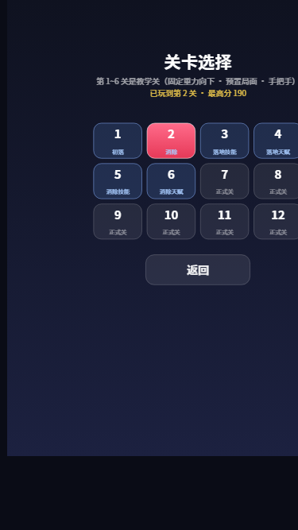
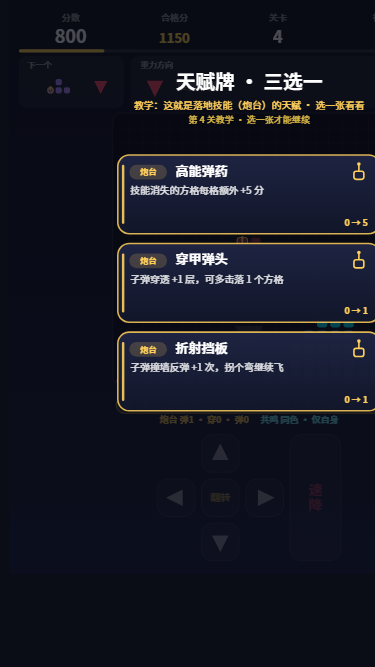
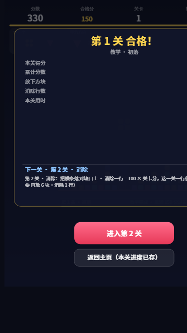

# 引力方块（dygame-cube）

一款抖音小游戏：四向重力方块消除玩法（合规文案，对外物料统一使用「方块消除玩法」表述）。

## 玩法特色

- **中心生成**：方块从 20×20 棋盘正中心生成，而非传统的顶部
- **随机重力**：每个方块的下落方向随机（下 / 左 / 上 / 右），重力侧的棋盘边缘会高亮显示
- **下落前提示**：方块正式下落前会停留片刻并闪烁，同时用大号箭头预告「方块类型 + 下落方向」；HUD 中还有「下一个」面板提前展示下一块的类型与方向
- **双向消行**：填满任意整行 **或** 整列即可消除（适配四向重力）
- **半侧沉降**：消除后**只有贴近消除线的那一半**方块朝着消除线滑动贴合，另一半保持原位（消行→上半下沉、下半不动；消列→近侧那半横向滑动）；滑动的这一半若凑齐新的整行/整列将连锁消除，一并计数计分
- **过关结算**：每关设有「合格分」（第 1 关 150 分、第 2 关 400 分、第 3 关 720 分、第 4 关 1150 分、第 5 关 2400 分、第 6 关 3600 分……逐关递增）。分数达到合格分（教学关还要完成本关门槛）后**先弹「过关结算」面板**：列出本关净拿分、落块数、消行数、技能战果与本关用时，并预告下一关的目标；点「进入第 N 关」才**清空棋盘、新关重开**（积分不清零、继续累加），点「返回主页」则停在原关卡、进度已存档。升关后下落更快、提示时间更短；HUD 顶部始终显示当前关合格分与进度条
  - **超收保护**：干净开局时本关入场分正好等于上一关合格分，所以下面这两道下限平时都不接管，及格线与曲线表值一字不变；只有上一关「爆分」了（第 3 关门廊连锁、第 5、6 关共鸣一炸上千分），本关合格分才会被抬到入场分之上，不至于进关就满格、合格分形同虚设
  - 教学关（1~6）要求本关至少净拿「曲线净增 × `TUTORIAL_NET_RATIO`」（0.8）；第 7 关起要求本关至少净拿 `LEVEL_CLIMB` + `LEVEL_CLIMB_STEP × (关卡-7)`，也不会一块方块连着跨好几关
  - HUD 进度条量的就是**本关净拿分**（起点 = 本关入场分，终点 = 本关合格分），所以爆分进关也是从 0 开始涨
- **教学关（第 1~6 关）**：`js/levelplan.js` 用脚本表把「消除 / 落地技能 / 消除技能 / 天赋牌」四件事手把手教会，详见下节
- **技能方块**（第 3 关起按概率出现，棋盘中随机一格带技能，两种类别）：
  - **炮台**（落地技能，金色徽章）：落位瞬间沿**反重力方向**发射能量弹，击落弹道上的方格；子弹会**穿过自己方块的其余格**（不打自己人，也不消耗穿透），只击落别人的方格；被击落的方格**原地消失、不引发沉降**（原方格保持），每格按构筑计分
  - **共鸣**（消除技能，青色徽章）：当它**被消除或被能量弹击落**时释放，把与它「同类」的方格一起带走（默认同颜色/同类型），并沿被带走的共鸣格继续级联引爆
  - **连锁各放各的技能**：被技能带走的方格若自己也是技能格，会当场释放**它本人的**技能（共鸣继续波及、炮台就地补射），每步单独计分、单独出特效（结算与事件按步拆分，`knock` 标记补射）
- **命中表现**：子弹命中 = 白热闪光 + 双层冲击波 + 8 道放射火花 + 四角碎块外飞 + 弹道十字/斜向火花，并伴随**棋盘震屏**（幅度按击落格数递增，0.26~0.3s 内衰减）与震动反馈；共鸣消失同理带青色爆点
- **属性牌三选一**（本局永久生效的构筑）：累计分数每跨过 `CARD.INTERVAL`（默认 700 分）弹出三张属性牌，选一张后**后续遇到的技能方块都会带上这份属性**
  - 教学关内改由脚本指定时机（第 4 关教炮台天赋、第 6 关教共鸣天赋），牌池**只出该系**、且**不允许跳过**（`plan.card = {score, minNet, tag, force}`）
  - 炮台系：子弹数（双联/三联/四联炮管）、穿透层数、撞墙反弹次数、单格加分
  - 共鸣系：同类判定维度扩展（同色 / 同层=同一行 / 同列=同一列，可叠加）+ 消失方式（爆炸周围 8 格 / 横向激光左右各 2 格 / 竖向激光上下各 2 格 / 十字激光四向各 2 格）
  - 通用：技能方块出现概率提升
  - 满级的属性牌不再进入牌池；待选牌时对局自动暂停，可跳过不发
- **玩家排行**：
  - 本机 TOP10（始终可用，本地持久化）
  - 好友排行榜（开放数据域 + 云端托管数据，需真机登录抖音）
- **金币与复活**：新手赠币、看激励视频、每日侧边栏复访均可得金币；游戏结束后可「看广告复活」或「金币复活」（每局一次，保留分数继续玩）
- **平台能力接入**（对应抖音审核检测项，全部带守卫降级，详见 `js/platform.js`）：
  - 侧边栏复访（必接）：`tt.navigateToScene({scene:'sidebar'})` 跳转 + `tt.checkScene` 可用性判断 + `tt.onShow` 启动来源检测 + 每日复访奖励
  - 添加到桌面：`tt.addToDesktop`
  - 订阅消息：`tt.requestSubscribeMessage`
  - 广告：激励视频 `tt.createRewardedVideoAd`（免费金币 / 复活）+ 插屏 `tt.createInterstitialAd`（结算页，90s 节流）
  - 内购：`tt.requestMidasPaymentGameItem`（需游戏版号；`PLATFORM.ENABLE_IAP=false` 时购买入口隐藏）
- **操作方式**：
  - 底部**固定十字**五键：上 / 下 / 左 / 右 各占一向，正中「翻转」旋转——**按键位置永远不随重力方向转**，`上=上移一格、下=下滑一格`（按屏幕方向，不是按重力）
  - 十字右侧独立「速降」长条键：立刻落底锁定（含硬降加分）
  - 手势：点击棋盘 = 旋转；向下快滑 = 速降；其余方向滑动 = 按屏幕方向平移（可连续多格）
  - 关卡选择页可从任意一关直接开局（`js/main.js` → `onButton('levelN')`）

## 教学关（第 1~6 关）

前 6 关是「半闯关半教学」：重力固定向下、局面开局铺好，棋盘下方一条教学条实时显示「本关目标 + 还差什么」。每关节奏统一为**自由玩耍 → 做出本关要教的动作 → 再自由玩耍**：门槛除了本关的核心动作，还都加一道「落块数」闸门（5~6 块），合格分也刻意高过「一次消除」的收入，**绝不会一块方块就直接跳关**；分数与门槛都达成后再弹「过关结算」面板，玩家看清成绩、亲手点「进入第 N 关」才跳关。

| 关卡 | 合格分 | 预置局面 | 强制发块 / 技能 | 教学门槛 | 教什么 |
| --- | --- | --- | --- | --- | --- |
| 1 | 150 | `starter`：底行只差中间 2 格（9、10 列），上方八根**落地短柱**（最高 3 格）散布左右与中段 | O（补齐底行） | 落 5 块 + 消除 1 行 | 认识「填满整行 → 消除得分」，多玩几块手感 |
| 2 | 400 | `clearRow`：底行留 4 格竖槽（8~11 列），八根落地短柱分列左右 | I（横条正好补满） | 落 6 块 + 消除 1 行 | 消除一行分数最高（100 × 关卡），第二行靠自由玩耍自己凑 |
| 3 | 720 | `turretRange`：**门廊**——左右两堵贴地实墙（0~1、18~19 列）+ 墙头两道横梁（5、6 行）当靶，中间 16 列是正常消行的门洞 | 每块带炮台格 | 落 5 块 + 消除 1 行 | 落地技能：炮台沿反重力方向开火，抬头看它打中天顶横梁（击落的方格也算分，但不硬卡准头） |
| 4 | 1150 | `turretField`：底行留竖槽 + 右侧贴地「斜塔」（Z/L/J/I 四层堆）、左侧 T 堆 | 每块带炮台格 | 落 5 块 + 选 1 张天赋牌 | 炮台系天赋（净增 80 分强制弹牌，不可跳过）；靶子改用玩家自己会堆出来的形状 |
| 5 | 2400 | `resoGarden`：底行整行同色 T + 六根同色落地短柱 + 3 颗共鸣种子（都在底行 8、11、15 列） | O + 共鸣格 | 落 5 块 + 消除 1 行 + 共鸣带走 2 格 | 消除技能：共鸣随整行一起引爆（补齐底行一次就同时引爆 3 颗，这一下通常上千分） |
| 6 | 3600 | `resoGarden` | O + 共鸣格 | 落 6 块 + 选 1 张共鸣天赋 + 共鸣带走 3 格 | 共鸣系天赋（净增 120 分强制弹牌） |
| 7+ | 递增（曲线 + 本关净拿分） | 无（空棋盘、四向随机重力、按概率出技能） | 随机 | 无 | 正式玩法 |

- 自动机器人实测（`node tools/check-tutorial.cjs <种子>`，落点用演示机器人的「消行优先」规划器 `AutoPlayer.planPlacement`）：四个种子里每一关都是 **5~6 块**过关（1/2/3/4/5/6 关分别 5、6、5、5、5、6 块）、全程 `stuck 0`，炮台天赋牌稳定落在第 4 关、共鸣天赋牌落在第 6 关
- **教学关预置局面的两条硬约束**（v1.5.1~v1.5.2 两轮试玩反馈逼出来的，改铺法必须复测）：
  ① **不许有孤立飘空的格子**——每格要么在底行，要么与底行四邻连通（允许长在立柱/墙上的横梁）。孤立浮块会在下一次消除被逐列压实（`js/board.js:151` `settle()` → `_compactDown`）时突然掉下来，看起来就像「消失的方块又重现」。回归测试：`test/tutorial.test.cjs` 从底行对每套 `SETUP_RULES[*].build()` 做 BFS，断言 `floating` 为空。
  ② **消除行的近侧绝不能再铺近乎满行**——它会原样塌进被消掉的那行，玩家看不出少了一行（`js/levelplan.js` 的 `starter` 旧版就是连续 4 排满行，第 1 关「消掉的那一行又长回来了」即此）。现在底行上方只放短柱，压实后底行必然带大洞。回归工具：`node tools/probe-clear.cjs <关卡>` 逐列打印消行前/后、`count`（第一块应为 1）与「落下后仍然满的行」。
  另外两条教训：预置局面**只在开局铺一次**（周期重铺机制 `retryEvery`/`retryOnCard` 已删除——它会把玩家已经消掉的格子整套写回棋盘，正是「第四块落下后消失的方块又重现」的真凶；回归测试断言每次落块后总格数 `<= 前值 + 4`）；炮台/共鸣打穿的洞与两侧贴地实墙会留下**永远填不满的竖井**（第 3 关旧版「立柱+屋顶」把 0~2、17~19 列封死，机器人 23 块就 Game Over；第 5 关共鸣炸完留下 col 8/11 空列，消 2 行门槛永远凑不满），所以墙必须整列连续、靶子留在场地中间、门槛别卡这种靠运气的指标。卡住时用 `node tools/probe-level.cjs <关卡>` 看这一关的门槛进度和终局棋盘。
- **关于「第一关四面八方都设计一下方块」与「消除后方块朝不同方向掉」**：方向性已经由**布局**提供——第 1 关的方块分布在左（col 1、2、5）、中（7）、右（12、14、16、18）与底行，消除后短柱各自下沉，视觉上整盘都在动；但**教学关 1~6 的重力刻意固定向下**（`PLANS[n].gravity = 0`），因为「四向随机重力 + 半侧沉降」是两个叠在一起的变量，新手在学前三关时同时理解不了，而且四向沉降会把「哪一排被补齐了」这件事变得不可读。四向随机重力从第 7 关正式登场，结算面板的「下一关预告」会专门点明这一点。想让沉降更彻底也不行：半侧沉降（只有贴近消除线的一侧压实、另一半保持悬空）是本作的核心机制，被 `test/core.test.cjs` 两条用例锁定；试过在炮台/共鸣之后追加一次整板压实，这两条测试立刻红，改动已回退——飘空与重现的问题应该由「铺法 + 删除重铺」解决，不该动沉降语义
- 脚本表在 [js/levelplan.js](js/levelplan.js)：`SETUP_RULES`（预置局面）、`PLANS`（重力/发块/技能/门槛/教学牌文案）、`gateStatus`（门槛进度，含 `locks` 落块数）、`guideText`（教学条文案，动作练完会改口提示「再拿 N 分就过关」）、`applySetup`（铺盘，绝不堵中心出生点）
- 教学关内**不发**通用节奏牌：通用分数线在 `js/gamecore.js` 的 `_syncCards()` 里逐段顺延，避免一进第 7 关就连环补牌；过关结算挂起时发牌也一并压后，确认进新关后再补判
- 想跳过教学：菜单「关卡选择」直接点第 7 关及以后

## 关卡进度与断点续玩

- [js/progress.js](js/progress.js) 用 `tt.setStorageSync` 存两样东西：`gravcube.checkpoint`（**每次进入新关卡时**写入的本关开局快照：关卡 / 分数 / 行数 / 已选牌 / 构筑）与 `gravcube.maxLevel`（到过的最高关）；无 `tt` 环境自动降级为内存，读取异常返回 null
- [js/gamecore.js](js/gamecore.js) 提供 `snapshot()` / `restoreLevel(state)` / `startLevel(n)`：存档沿用「第 n 关开局」的状态（分数 = 上一关合格分、棋盘按脚本重建），不是逐帧恢复残局
- 主菜单按存档自动变成 **继续 · 第 N 关**（主按钮）+ **重玩第 1 关**；没有存档时是「开始游戏」（从第 1 关教学开局）
- 结算页「再来一局」和暂停页「重新开始」都**回到本关开局断点**，进度不丢
- 「过关结算」面板上点「返回主页」也安全：断点仍是**本关开局**（确认过关才会推进到下一关并覆盖断点）

## 目录结构

```
game/
├── game.js                 # 小游戏入口
├── game.json               # 全局配置（竖屏、开放数据域）
├── project.config.json     # 开发者工具项目配置（需填入 AppID）
├── js/
│   ├── config.js           # 常量配置（棋盘、速度、计分、关卡合格分、教学开关、沉降规则、技能与属性牌、配色）
│   ├── tetromino.js        # 7 种方块定义与旋转（纯逻辑）
│   ├── board.js            # 棋盘网格：碰撞、锁定、行列消除、半侧沉降、技能格（纯逻辑）
│   ├── skills.js           # 技能与属性牌：炮台弹道、共鸣波及与级联、牌池与加成（可按系别过滤发牌）
│   ├── levelplan.js        # 教学关脚本表：预置局面 / 门槛 / 强制发块 / 教学牌 / 教学条文案
│   ├── gamecore.js         # 核心状态机：hint → fall → lock → 技能结算 → 过关结算/清场 → 属性牌 → 存档快照
│   ├── render.js           # Canvas 2D 渲染与布局（固定十字按键、教学条/目标卡、选关页、技能特效）
│   ├── input.js            # 触摸手势（点按 / 滑动）
│   ├── platform.js         # 平台能力：侧边栏复访/桌面/订阅/广告/内购/金币钱包
│   ├── rank.js             # 排行榜：本地存储 + 云端托管 + 分享
│   ├── progress.js         # 关卡断点存档（tt.setStorageSync，无 tt 时内存降级）
│   └── main.js             # 主控制器：游戏循环、场景切换（含 cards / levels 场景）
├── openDataContext/
│   └── index.js            # 开放数据域：好友排行榜渲染（独立上下文）
└── test/
    ├── core.test.cjs       # 核心逻辑单元测试
    └── tutorial.test.cjs   # 教学关逐关效果 / 门槛 / 存档测试
```

纯逻辑层（config / tetromino / board / skills / gamecore）不依赖任何抖音 API，可直接在 Node 中测试。

## 本地测试

需要 Node.js ≥ 18：

```bash
node --test test/core.test.cjs
```

覆盖：旋转与踢墙、行列消除、**半侧沉降**（消行/消列的近侧压实 + 连锁）、四向重力锁定、计分、**过关结算（达标先挂起、确认后才清场；升关不清分、溢出一次并进、全清无残留）**、速度下限、游戏结束判定、复活（revive）、**技能格（炮台落地开火 / 穿过己方方块 / 穿透·反弹·多管·激光 / 共鸣同类引爆 / 被带走的格子各自释放技能＝补射）**、**属性牌（发牌、选择、跳过、构筑生效、技能格携带 mods）** 等 56 个用例；另有 [test/tutorial.test.cjs](test/tutorial.test.cjs) 20 个用例覆盖**教学关**：新分数曲线（每档都高过「一次消除」的收入 + 每关都有一道 ≥5 块的落块闸门）、预置局面不堵出生点、**预置局面没有孤立飘空的格子（从底行 BFS）**、**落块过程中被消除/被击落的格子不会被系统写回棋盘（总格数每次最多 +4）**、逐关教学效果（第 1~6 关各自能不能消行/开炮/引爆共鸣/弹天赋牌）、**落块门槛未完成时不升关**、结算面板只推进一关、第 7 关起的净增分下限、`moveDir` 绝对四向、`snapshot/restoreLevel` 往返与断点存档——合计 **76** 个用例。

集成冒烟测试（在 Node 中以模拟 tt 环境 + Canvas 打桩运行整个游戏：场景切换、按钮/手势输入、**教学关第 1 关亲手消行 + 断点落盘 + 菜单「继续 第 N 关」接上 + 关卡选择跳到第 7 关**、完整一局打到游戏结束、分享、侧边栏复访领奖/跳转、添加到桌面、订阅消息、激励视频得金币、广告复活、插屏节流、开放数据域渲染）：

```bash
node web-preview/smoke.cjs
```

教学关还有三个**数值自检**工具（改了铺法 / 门槛 / 曲线必须跑，别靠肉眼判断）：

```bash
node tools/check-tutorial.cjs t-1    # 机器人从第 1 关打到第 7 关：逐关打印合格分、预置、门槛、净拿分与落块数；结尾 stuck 必须为 0
node tools/probe-clear.cjs 1        # 某一关第一块落下的消行细节：逐列打印消行前/后、count（第 1 关应为 1）、塌陷后是否还有满行
node tools/probe-level.cjs 3         # 某一关卡住时：门槛进度、levelStats、终局棋盘（用来发现「永远填不满的竖井」）
```

`check-tutorial.cjs` 的落点用的是演示机器人的真规划器 `AutoPlayer.planPlacement(…, 'score')`（消行优先、主动用技能），比随手中间落子更接近跟着教学条玩的真人；第二个参数是最多落几块（默认 120）。一次只吃一个种子，建议多跑几个（`t-1`、`t-2`、`t-3`、`t-4` 各跑一遍）——第 3、5 关的技能收入方差很大。

## 浏览器预览（无需安装抖音开发者工具）

```bash
node web-preview/serve.cjs
```

打开终端显示的地址（默认 <http://127.0.0.1:8737>，端口被占用时自动 +1）：

- `web-preview/tt-shim.js` 把 `tt.*` API 补齐为浏览器等价物：画布 → `<canvas>`、触摸 → 鼠标/触屏事件、存储 → localStorage
- 桌面鼠标操作：单击 = 点按（棋盘上＝旋转，其余＝按按钮，底部为固定的 上/下/左/右/翻转 + 速降 十字按键），按住拖动 = 按**屏幕方向**滑动（下＝速降，其余＝平移若干格）
- 好友排行榜依赖开放数据域，浏览器中不可用，自动降级为本机排行；其余玩法与真机一致
- `serve.cjs` 启动时自动执行 `build.cjs`，将 CommonJS 模块打包为 `web-preview/bundle.js`（构建产物，已在 .gitignore 中忽略）

## 自动化演示（脚本对局 + 场景截图）

`web-preview/demo.html`（内联脚本 + `demo.js`）在浏览器中自动播放一局**脚本化确定性对局**：种子随机流（mulberry32(42)）+ 固定虚拟时间线 —— 开局（第 1 关教学：预置局面 + 目标卡）→ 下落前提示 → 下落 → 消行 → **过关结算面板** → 点「进入第 2 关」→ 游戏结束 → 排行榜 → 关卡选择 → 第 4 关强制天赋牌 → 第 1 关过关结算。配合无头浏览器的 `--virtual-time-budget`（虚拟时钟，确定性回放）即可自动截取各关键场景：

```powershell
node web-preview/serve.cjs   # 先保持服务运行（服务根目录＝web-preview，故 URL 是 /demo.html）
# 各帧截图预算(ms)：1-menu=250  2-hint=950  3-fall=4200  4-clear=5150
#                5-levelup=5750（过关结算面板）  6-gameover=6500  7-rank=7100
#                8-levels=7600（关卡选择页）  9-tutcard=8600（第 4 关天赋牌）
#                10-clearpanel=9700（第 1 关过关结算）
& "C:\Program Files (x86)\Microsoft\Edge\Application\msedge.exe" --headless=new --disable-gpu `
  --hide-scrollbars --force-device-scale-factor=1 --window-size=390,844 `
  --user-data-dir="$env:TEMP\gcdemo-hint" --virtual-time-budget=950 `
  --screenshot=web-preview/shots/2-hint.png "http://127.0.0.1:8737/demo.html"
```

演示截图（`web-preview/shots/`，本轮已用 v1.5.0 重新截取）：






## 演示视频自动录制（自动游玩 + 配音 + 无头录制）

一条命令产出一条 1080×1920 竖屏对局视频：浏览器预览页由自动玩家 bot 实时操作，配音按事件触发，画面与解说都是玩家视角、无任何「自动/AI」标识。

| 环节 | 脚本 | 说明 |
| --- | --- | --- |
| 离线选种 | `web-preview/simulate.cjs` | Node 中跑完整对局，按「新特性是否出镜 + 成片时长」打分排序；`--write-seeds` 写出 `web-preview/seeds.json` |
| 自动玩家 | `web-preview/autoplayer.js` | UMD，浏览器与 Node 共用。规划时借用游戏自身的 `js/board.js` / `js/skills.js`（浏览器侧经 `window.__bundleRequire` 取到**同一份模块实例**），在草稿盘上复刻 `gamecore._lock` 的结算顺序：锁定 → 技能格落位 → 炮台开火 + 共鸣级联 → 行列消除 → 共鸣 → 半侧沉降 → 连锁。所以 bot 不只是会消行，还**主动用技能**：炮台瞄准人堆打、把共鸣格塞进即将成形的整行/整列里引爆 |
| 属性牌决策 | 同上 `chooseCardIndex` | 三选一按固定偏好顺序（炮台流优先），无随机 → 仿真选出的种子在录制页必然复现同一局 |
| 配音台词 | `tools/gen-narration.cjs` | Edge TTS（`zh-CN-YunxiNeural`）合成 `web-preview/media/narration/*.mp3` + `clips.json`；`--missing` 只重生成文案变过的条目；websocket 偶发失败自动退避重试 |
| 录制 | `web-preview/record.cjs` + `web-preview/recorder.js` | 无头 Edge（`--window-size=540,960 --force-device-scale-factor=2`）打开 `record.html`，页面内 `MediaRecorder` 录 H.264/AAC，结束后 `POST /__recording` 落盘 `web-preview/videos/<name>.mp4` 并修补 fMP4 时长 |
| 每日一条 | `tools/daily-record.cjs` | 按日期从 `seeds.json` 轮转取种子录制，命名 `gravity-cube-<yyyymmdd>.mp4` |
| 抽帧校验 | `web-preview/verify.cjs` | 按时间点抽帧，确认分辨率与关键画面（技能徽章、弹道、属性牌面板） |

### 导演层：新特性怎么被「讲」出来

`recorder.js` 不改游戏源码，只**包一层 `main.processEvents`**，在它排空 `core.events` 之前先读一遍事件队列，再按事件配音效与解说：

| 事件 | 表现 |
| --- | --- |
| `turret` | 开火「咻」+ 命中闷响；击落 >0 解说「炮台开火！」，≥6 格换成「这一发直接带走一整排」，11s 节流 |
| `resonance` | 上滑音 + 引爆低频；解说「共鸣引爆！」 |
| `clear`（`settled>0`，仅首次） | 解说「半侧沉降」：只有贴近消除线那一半滑动压实 |
| `levelup`（`skills=true`，仅首次） | 解说技能方块登场：金色炮台 / 青色共鸣 |
| `cards` / `cardpick`（bot 钩子 `onCardOffer` / `onCardPick`） | 解说「属性牌三选一」，选完再按牌系补一句（炮台 / 共鸣 / 通用）；对局在此暂停，`--cardhold`（默认 6500ms）保证牌面看得清、台词讲得完 |

排队台词带 6s 有效期（`ttl`），过期直接丢弃——新特性解说讲究此时此刻，宁可不说也不迟说；结算台词例外（`ttl: 20000`），保证战绩一定播得出来。

### 常用命令

```powershell
# 1) 离线选种（要求炮台/共鸣/属性牌/沉降全部出镜，并写入 seeds.json）
node web-preview/simulate.cjs --search 1..240 --finish 100000 --min-turret 3 --min-reso 1 --min-cards 2 --write-seeds

# 2) 生成配音（基础台词 + 种子池战绩台词；--missing 跳过未改文案，--prune 清掉换池后失效的战绩）
node tools/gen-narration.cjs --base --seed all --missing --prune

# 3) 录制（约 2.5 分钟，按真实时间录制）
node web-preview/record.cjs --seed 144 --finish 100000 --name gravity-cube-20261001

# 3b) 跳过前面几关（演示新特性时用，直接从第 N 关开局，积分接着上一关合格分累计）
node web-preview/record.cjs --seed 35 --startlevel 3 --finish 45000 --name demo-skills
#   ↑ 注意：level 越高技能格越密，炮台把刚堆好的一行打缺，消行数会明显下降
#     （实测 startlevel=3 三局 lines=0）。要「消行+沉降+技能+属性牌」同框，
#     优先用第 1 步选出的种子从第 1 关自然打到第 3 关。

# 4) 抽帧校验（fMP4 没有随机索引，用顺序播放采样而非 seek）
node web-preview/verify.cjs --file videos/gravity-cube-20261001.mp4 --times 43,74,77,106 --mode play --rate 8
```

### 本轮成片（2026-10-01 · 固定步长录制 `--fixed 1`）

[web-preview/videos/gravity-cube-20261001-3.mp4](web-preview/videos/gravity-cube-20261001-3.mp4)
— 1080×1920 / 2 分 27 秒 / 17.1 MB，`--seed 1004 --finish 100000`。实录战绩与离线仿真**逐位一致**（`narrationOk / levelMatch / linesMatch / skillKillsMatch / featuresOk` 全 true）：2290 分、53 块、消 4 行、炮台开火 9 次击落 15 格、共鸣引爆 2 次带走 8 格、技能合计击落 23 格、半侧沉降 117 格、属性牌 2 张（双联炮管 → 共振行列）——结尾配音报的就是画面上这几个数字。

对局内看点（视频时间 ≈ 对局时间 +4.7s）：

| 对局时刻 | 看点 |
|---|---|
| 28.3s / 35.4s / 38.4s / 55.5s | 四次消行，其中 38.4s 与 **L1→L2 过关清场**同帧、55.5s 与**共鸣引爆**同帧 |
| 62.8s / 64.6s / 66.6s×3 | **炮台三连射**，66.6s 的三连与第二次共鸣同刻（补射各自独立成事件、独立计分） |
| 68.4s | **L2→L3 过关清场**，棋盘清空重开、积分累加 |
| 71.8s / 78.9s / 96.4s | 炮台命中爆点：白热核心 + 双层冲击波 + 8 道火花 + 震屏 |
| 101.6s / 105.6s | **属性牌三选一**两次：双联炮管 → 共振行列（牌面停留 6.5s，对局暂停） |
| 105.2s | 构筑生效后的双发弹幕 + 击落 |
| 117.3s | 收尾：2290 分 / 第 3 关 / 消 4 行 / 技能 23 格 |

[web-preview/videos/gravity-cube-20261001-4.mp4](web-preview/videos/gravity-cube-20261001-4.mp4)
— 1080×1920 / 2 分 29 秒 / 16.8 MB，`--seed 601 --finish 100000`，同样逐位一致：2370 分、54 块、消 3 行（含一次**双消**）、共鸣 4 次带走 18 格、炮台 9 次、技能合计 24 格、沉降 110 格、属性牌 2 张（灵能灌注 → 折射挡板）。看点在 51.7s（消行 + 共鸣同帧）、76.4s（过关清场 + 共鸣 + 炮台三事同刻）、101.4s（共鸣引爆立刻招出炮台补射）。

> 两条都是「选种 → 配音 → 固定步长录制 → 交叉校验」一条龙产出，归档在 `web-preview/videos/`（该目录已被 `.gitignore` 忽略，成片不入库）。

**投稿记录**：`gravity-cube-20261001-3.mp4` 已于 2026-10-02 11:44 投稿到抖音创作者中心（账号「人类观察师二号」），标题「这局手气爆棚，炮台共鸣连开，2290分冲到第3关」，简介报的正是画面战绩（2290 分 / 炮台 9 次 / 共鸣 2 次）。投稿链路：专用 `--user-data-dir=%TEMP%\dygame-edge` 的常驻 Edge（CDP 9333，一次性登录后 cookie 留在该 profile）→ `node tools/douyin-publish.cjs upload --file <成片> --title <标题> --desc <简介>` 只填表单 + `[pub] FILLED` 回读校验 → `publish` 用**页内 `el.click()`** 点「发布」（`ElementHandle.click()` 会卡在元素稳定性等待）。作品管理显示 **已发布**。

### 本轮（v1.3.1）复查用 demo

[web-preview/videos/demo-gravity-cube-v131.mp4](web-preview/videos/demo-gravity-cube-v131.mp4)
— 1080×1920 / 2 分 34 秒 / 15.9 MB，`--seed 144 --finish 100000`，从第 1 关自然打到第 3 关。实录战绩与当前 HEAD 的离线仿真逐位一致（mismatch=0/0）：2591 分、55 块、消 4 行、炮台开火 6 次击落 8 格、共鸣 3 次带走 19 格、半侧沉降 91 格、属性牌 2 张（穿甲弹头 → 折射挡板）。

对局内看点（视频时间 ≈ 对局时间 +6s，前面是菜单与开场白）：

| 对局时刻 | 看点 |
|---|---|
| 26.2s / 33.7s / 52.0s / 100.9s | 消行 + **半侧沉降**：分别滑动压实 36 / 32 / 11 / 12 格，另一半保持原位 |
| 38s、80s | **过关清场**：棋盘整体清空、下一关重开，积分累加不清零（L1→L2→L3） |
| 48.9s、58.9s | **炮台命中爆点**：白热核心 + 双层冲击波 + 8 道火花 + 碎块外飞 + 棋盘震屏 |
| 68.8s | **共鸣 8 格 + 同一毫秒的炮台补射**——被共鸣带走的炮台格当场放出自己的技能（`knock` 步，独立事件、独立特效、独立计分） |
| 71.0s、94.2s | **属性牌三选一**：对局暂停，牌面停留 `--cardhold`（默认 6.5s），选完按牌系补解说 |
| 80.3s | 共鸣 10 格 + 补射 2 格同框连锁 |
| 108.8s | 构筑生效后的收尾：共鸣引爆 + 击落 2 格（120 分） |

> 「子弹穿过自己方块的其余格」属于逐帧难以肉眼确认的细节，已在测试里锁定：
> `core：子弹穿过自己方块的其余格…（不打到自己人）`、`skills：子弹穿过己方格（ignore），不击落也不消耗穿透`，
> 冒烟亦断言命中处 `grid[y][x]` 仍为自己方块的格。
>
> **平衡观察**：用 `--startlevel 3` 跳关录了三条，消行数全为 0——关卡越高技能格越密，
> 炮台把刚堆满的一行打缺，越往后越难消行。若觉得后期手感被打断，优先调低
> `SKILL.CHANCE`（0.30 → 0.18 左右）或压低 `SKILL.WEIGHT.turret`。

### 上一版成片

[web-preview/videos/gravity-cube-20261001.mp4](web-preview/videos/gravity-cube-20261001.mp4)
（1080×1920 / 2 分 38 秒 / 15.7 MB。实录战绩：2605 分、第 3 关、消 4 行、55 块；过关清场 2 次、炮台开火 6 次击落 27 格、共鸣引爆 2 次带走 18 格、半侧沉降 85 格、属性牌三选一 2 次（穿甲弹头 → 双联炮管，第 109 秒的双发弹幕就是它生效的样子），结尾播报的就是这几个真实数字。）

> **一致性保证（录制端固定步长）**：`(gameSeed, botSeed, finishAfterMs)` 相同 ⇒ 离线仿真与浏览器录制逐位一致（属性牌暂停时长不计入对局时长，改 `--cardhold` 不会改局面）。
>
> headless Edge（`--disable-gpu`）录制时只有 ~30fps：帧间隔 ≈33ms，还受 MediaRecorder 负载抖动，
> 而 `js/main.js:474-479` 的循环按真实 dt 推进（钳到 100ms）。真实 dt 下 bot 的决策时机与仿真（`DT = 16.7`）错位，
> 落子位置就会漂——实测 seed 1004 用真实帧间隔录出来是 **2027 分 / 技能 19 格**，而仿真与配音是 2290 / 23 格。
> 所以 `web-preview/recorder.js` 的驱动器（默认 `fixed=1`）把对局改成「累计真实时间 → 每 16.7ms 喂一次 `core.update`
> → drain 事件 → `bot.tick(虚拟时钟)`」，与 `simulate.cjs` 的主循环同构；`core.update` 在 main 的循环里被架空（只计数），
> bot 的 `setInterval` 也停掉，避免两套时钟打架。卡顿时**不追帧**（`vslow` 计数，宁可慢放不快进），
> 因此局面序列只由种子决定。`--fixed 0` 退回真实帧间隔（战绩会漂，出片不要用）。
>
> `record.cjs` 结束时把实录的分数 / 关卡 / 消行数 / 技能击落格数与 `seeds.json` 比对，
> 输出 `narrationOk` / `levelMatch` / `linesMatch` / `skillKillsMatch` / `featuresOk`；
> `narrationOk` = 分数同百位桶 **且** 关卡、消行、技能格数与画面完全一致（结尾配音会逐字报出这几个数字）。
> 出现 false 说明规则或 bot 权重改过，需要重跑第 1、2 步再录，否则结尾配音的战绩数字会对不上画面。

## 在抖音开发者工具中运行

1. 下载安装 [抖音开发者工具](https://developer.open-douyin.com/docs/resource/zh-CN/mini-game/develop/developer-instrument/developer-instrument-update-and-download)
2. 打开工具 → 导入项目 → 选择本仓库目录
3. AppID：本项目已填入 AppID `ttb7bec10329c6ac6c02`（`project.config.json` 的 `appid` 字段），导入后工具会自动识别；如需更换，请在[抖音开放平台](https://developer.open-douyin.com/)获取新 AppID（形如 `tt` 开头）并替换该字段
4. 编译后即可在模拟器中游玩；真机预览用工具右上角「预览」扫码

> 注意：好友排行榜依赖开放数据域与云端托管数据，模拟器中可能不完整，请以真机为准。所有 `tt.*` 调用均有守卫，API 缺失时自动降级为本机排行，不会报错崩溃。

## 发布上线

完整流程见 [上线指南.md](./上线指南.md)。

## 调参

游戏数值集中在 `js/config.js`：

| 配置 | 默认值 | 说明 |
|---|---|---|
| `COLS`/`ROWS` | 20×20 | 棋盘尺寸 |
| `FALL_BASE` | 500ms | 第 1 关每格下落间隔 |
| `FALL_STEP` | 40ms | 每关加快量 |
| `FALL_MIN` | 80ms | 最快速度下限 |
| `HINT_BASE` | 1000ms | 第 1 关下落前提示时长 |
| `LEVEL_TARGETS` | [150, 400, 720, 1150, 2400, 3600, 4300, 5100, 6000, 7000] | 前 10 关的合格分（累计分数目标），**每关多少分合格直接改这里**；教学关（1~6）刻意高过「一次消除」的收入，配合落块门槛形成「玩→教→玩」的节奏。v1.5.2 重排：第 1、2 关下调（220→150、420→400，预置改薄后底行缺口一填就消，实测净拿分只有 160 / 288，旧分数会让人堆三四十块）；第 3、4 关上调（640→720、880→1150，让每档净增 320 / 430 严格高过该关一次消除的 300 / 400）；第 5、6 关抬高（1800→2400、2400→3600，共鸣一炸实测 1572 / 1890 分，太松就会让「一块顺手撞开结算」复发——卡住玩家的应该是门槛而不是分数） |
| `LEVEL_TARGET_STEP` | 60 | 第 10 关之后按公式外推：第 n 关需再净得 `STEP × n` 分 |
| `LEVEL_CLIMB` / `LEVEL_CLIMB_STEP` | 400 / 100 | 第 7 关起额外要求「本关至少净增 `CLIMB + STEP×(关卡-7)` 分」，防止一次技能爆分连着跨好几关 |
| `TUTORIAL_NET_RATIO` | 0.8 | 教学关（1~6）的超收保护：合格分取「曲线表值」与「本关入场分 + 表值净增 × 该比例」的较大者。干净开局时表值更大（`入场分 + 0.8×净增 < 表值` 恒成立），及格线不变；只有上一关爆分才接管，避免进关就满格。实测第 4、5、6 关因此从 1150/2400/3600 抬到约 2430/3560/5100，机器人仍是 5/5/6 块过关 |
| `TUTORIAL` | ENABLED / MAX_LEVEL 6 / GRAVITY 0 / SHOW_GUIDE | 教学关总开关、教到第几关、教学关重力（0=向下）、是否显示棋盘下方的教学条；`MAX_LEVEL` 改小时第 7 关起的曲线照旧 |
| `SCORE_TABLE` | [0,100,250,500,800] | 同时消 1~4 行的基础分（×关卡数） |
| `BOARD_SCALE` | 1.0 | 棋盘（方块）整体缩放：调小方块更小，1 为铺满可用宽度 |

沉降规则与技能/构筑集中在同文件的 `SETTLE` / `SKILL` / `CARD`：

| 配置 | 默认值 | 说明 |
|---|---|---|
| `SETTLE.ROW_SIDE` | `'above'` | 消行时随之下沉的一侧：`above`＝消除线上方（默认，符合「往下沉」直觉）；`below`＝下方；`both`＝两侧都朝消除线贴合 |
| `SETTLE.COL_SIDE` | `'left'` | 消列时横向滑动的一侧：`left`／`right`／`both` |
| `SKILL.START_LEVEL` | 3 | 从第几关开始出现技能方块（第 3 关＝炮台教学，第 5 关＝共鸣教学） |
| `SKILL.CHANCE` / `CHANCE_STEP` / `CHANCE_MAX` | 0.30 / 0.10 / 0.85 | 技能格出现概率（每拿一张「灵能灌注」+STEP，封顶 MAX） |
| `SKILL.WEIGHT` | turret 0.55 / resonance 0.45 | 两类技能格的出现权重 |
| `SKILL.BASE_CELL_SCORE` / `CELL_SCORE_STEP` | 20 / 5 | 技能消失每格基础分（×关卡数），「高能弹药」每层 +STEP |
| `SKILL.BULLET_FRAME` | 70ms | 子弹每走一格的动画时长（渲染与等待用） |
| `SKILL.CASCADE_LIMIT` | 160 | 共鸣级联最多引爆的共鸣格数（防同色大范围互相引爆死循环） |
| `SKILL.ACCENT` | 金 / 青 | 炮台、共鸣的徽章主色 |
| `CARD.INTERVAL` | 700 | **每多少分弹一次属性牌三选一**（改这里即可调整节奏）；教学关内这条线逐段顺延，第 4/6 关改由 `js/levelplan.js` 的 `plan.card` 指定触发分与牌系 |
| `CARD.CHOICES` | 3 | 每次发几张牌 |
| 牌池 | `js/skills.js` 的 `CARD_POOL` | 每张牌的名字/说明/上限/作用，加新牌就在这里加一条；`availableCards(mods, tag)` 可按系别过滤（教学牌用） |

平台能力配置集中在 `PLATFORM`（同文件）：

| 配置 | 默认值 | 说明 |
|---|---|---|
| `REWARDED_AD_UNIT_ID` | 文档示例占位 | **TODO**：替换为后台创建的激励视频广告位 ID |
| `INTERSTITIAL_AD_UNIT_ID` | 文档示例占位 | **TODO**：替换为后台创建的插屏广告位 ID |
| `SUBSCRIBE_TMPL_IDS` | 占位 | **TODO**：替换为后台「功能→订阅消息」创建的模板 ID |
| `ENABLE_IAP` | `false` | 内购入口开关；拿到版号并配置道具后改 `true` |
| `IAP` | coins_100 | 内购道具（productId / 价格 / 金币数） |
| `WELCOME_COINS` | 30 | 新手赠币 |
| `REVIVE_COIN_COST` | 30 | 金币复活消耗 |
| `AD_REWARD_COINS` | 50 | 看一次激励视频奖励 |
| `SIDEBAR_REWARD_COINS` | 60 | 每日侧边栏复访奖励 |

## 版本记录

### v1.5.2 — 预置方块全部落地 · 删除周期重铺（本轮）

> 试玩反馈两件事（v1.5.1 的修法都不成立）：「第一关那些方块全在空间里飘着，他应该往下落呀，方块该沉底沉底呀」；「第四块落下后，一些消失的方块又重现了」。还有一句很关键的批评：「你不改完不检查的吗？」——本轮因此全部用数值工具复测（`tools/probe-clear.cjs`、`tools/probe-level.cjs`、`tools/check-tutorial.cjs`、76 个单测、冒烟），不再凭肉眼判断。

| 变更 | 代码位置 |
|---|---|
| **预置局面 1~6 关全部改成「贴地」铺法**：底行近乎满行（留 2~4 格缺口）+ 一排**与底行四邻连通的落地短柱**（最高 3 格）；允许长在立柱/墙上的横梁，**禁止任何孤立浮空块**。v1.5.1 那版撒在第 6/10/13/16/17 行的孤立单格正是「消失的方块又重现」的元凶——它们要等下一次消除被逐列压实（`js/board.js:151` `settle()` → `_compactDown`）才突然掉下来 | `js/levelplan.js`（`SETUP_RULES.starter`/`clearRow`/`turretRange`/`turretField`/`resoGarden`） |
| **彻底删除周期性重铺机制**（`retryEvery` / `retryOnCard` / `retryPending` / `_tutorialTick`）：`spawn()` 里会重新 `applySetup()` 把**整套预置写回棋盘**，只跳过非空位与中心出生盒——于是玩家已经消掉的格子被系统原样补回，第 4 块落下（`retryEvery=4`）就重现，与用户描述完全吻合。缺口不需要补：强制发块队列在门槛没完成前一直循环给 O/I，剩下的落块数门槛就是「自由玩耍」那一段。预置现在**只在开局铺一次** | `js/levelplan.js`（`PLANS[*]` 去掉 6 处 `retryEvery` + 2 处 `retryOnCard`）、`js/gamecore.js`（删构造器字段、`_beginLevel`、`_tutorialTick()`、`pickCard` 的 retry 行、`spawn()` 的 retry 消费块、`update()` 调用） |
| 新增 helper `pillar(cells, [[列, 高出底行的格数, 类型?], …], type?)`、`wall(p0, p1, topRow, bottomRow, type)`；删掉造出浮块的 `scatter()` 与 `colPillar()` | `js/levelplan.js` |
| **第 3 关靶场改成「门廊」**（先前两版都被实测推翻）：左右两堵**整列连续**的贴地实墙（0~1、18~19 列）+ 墙头两道横梁当靶。旧版「悬浮靶面」违反不飘空；旧版「立柱带空洞 + 横跨屋顶」则 ① 屋顶第一发就被打空、击落数门槛凑不满，② 两侧墙把 0~2、17~19 列封成永远填不满的死洞，中间堆到第 8 行就再也喂不进方块，机器人 23 块 Game Over。**击落数不再作硬门槛**（依赖准头，会把教学卡死），改为「击落的方格也算分」，第 3 关门槛 = 落 5 块 + 消 1 行 | `js/levelplan.js`（`SETUP_RULES.turretRange`、`PLANS[3]`） |
| **第 4 关改用新铺法 `turretField`**：底行留竖槽 + 右侧贴地「斜塔」（Z/L/J/I 四层）+ 左侧 T 堆，当弹道目标——上一关的门廊多半已被玩家打烂，不该再指望它；门槛删掉击落数，只留落 5 块 + 选 1 张牌 | `js/levelplan.js`（新增 `SETUP_RULES.turretField`、`PLANS[4]`） |
| **第 5 关门槛 `消除 2 行` → `消除 1 行`**：共鸣必须靠消行引爆，而三颗共鸣种子（8、11、15 列）都挂在底行，补齐底行一次就同时引爆 3 次、带走 10~12 格；再硬卡第二行是重复且不现实的约束（实测第 5 关炸完留下 col 8/11 两条空列，机器人 45 块都凑不满第二行）。第 2 关同理改成落 6 块 + 消 1 行 | `js/levelplan.js`（`PLANS[5]`/`PLANS[2]`） |
| **合格分曲线重排**（220/420/640/880/1800/2400 → **150/400/720/1150/2400/3600**）：第 1、2 关**下调**——棋盘改薄之后底行缺口一填就消，不再需要厚墙和重铺来凑分（实测净拿分 160 / 288，旧分数会让玩家堆三四十块才够，而分数与门槛都达成才弹结算，缺一个就是死卡）；第 3、4 关**上调**——把每档净增抬到 320 / 430，严格高过该关「一次消除」的收入（100×关卡 = 300 / 400）；第 5、6 关**抬高**——共鸣一炸实测就有 1572 / 1890 分，分数太松会让「一块方块顺手把结算撞开」复发，真正卡人的应该是门槛（落 5/6 块 + 消 1 行 + 共鸣 2/3 格）。机器人实测每关 5/6/5/5/5/6 块、`stuck 0` | `js/config.js`（`LEVEL_TARGETS` → 150/400/720/1150/2400/3600/4300/5100/6000/7000） |
| **补上「超收保护」**：曲线改完实测发现第 3 关净拿 1638、第 5 关 1572、第 6 关 1890，进下一关时分数早已越过表值合格分（第 4 关入场 2086 vs 表值 1150），HUD 进度条全程满格、合格分形同虚设——正是用户骂过的「一个消除直接过关」的变体。现在教学关合格分 = `max(表值, 本关入场分 + 表值净增 × TUTORIAL_NET_RATIO)`，干净开局时表值更大所以及格线一字不变，只有上一关爆分才接管；进度条起点也从「上一关合格分」改成本关入场分（量本关净拿分，爆分进关不再天生满格） | `js/config.js`（新增 `TUTORIAL_NET_RATIO = 0.8`）、`js/gamecore.js`（`levelTarget`）、`js/render.js`（`drawHud` 进度条） |
| 新增两条教学关回归测试：① 每套 `SETUP_RULES[*].build()` 从底行做 4 邻 BFS，断言**没有孤立飘空的格子**；② 1~6 关各最多落 14 块，断言每次落块后**总格数最多 +4**（暴涨即是被系统写回）。曲线测试同时新增「每个教学关恰有一道 `locks ≥ 5` 闸门」的断言，并把「反一块过关」改成按净拿分判断（7~10 关净增刻意等于 100×lv） | `test/tutorial.test.cjs` |
| 机器人节奏实测改用它**真规划器** `AutoPlayer.planPlacement(…, 'score')`（消行优先，代替自写的 `gapCenter`，更贴近跟着教学条玩的真人）：四个种子 1→6 关全通、每关 **5/6/5/5/5/6 块**、`stuck 0` | `tools/check-tutorial.cjs`、`web-preview/autoplayer.js` |
| 新增排障工具 `tools/probe-level.cjs <关卡> [种子]`（打印某一关卡住时的门槛进度、`levelStats`、终局棋盘与技能列），由临时脚本 `probe-l3.cjs` 改名固化；临时复现脚本 `tools/repro-l1.cjs` 删除 | `tools/probe-level.cjs` |
| 验证与同步：测试 **76/76**（core 56 + tutorial 20）、`node web-preview/smoke.cjs` SMOKE OK（教学关 → 结算面板 → 第 2 关）、`node tools/probe-clear.cjs 1~6` 六关全部 `count` 正常且「落下后仍然满的行：无」；四个种子重跑仍是每关 **5/6/5/5/5/6 块**、`stuck 0`（超收保护生效后第 4~6 关合格分被抬到约 2430~2480 / 3556~3608 / 5088~5290，落块数不变）；README 教学关表 / 铺法约束 / 调参表重写，页脚版本 v1.5.2，bundle 与十张演示图重截 | `js/render.js:461`、`README.md`、`上线指南.md`、`web-preview/shots/` |

### v1.5.1 — 教学关预置局面可读性

| 变更 | 代码位置 |
|---|---|
| **修掉「消掉的那一行又长回来了」**：第 1 关旧预置是连续 4 排近乎满行，消除行的近侧逐列塌到消除线，紧贴上方的满行立刻原样补位 → 玩家看到底行没变。按「每列 ≤2 块 + 留 6 个空列」重铺后 `count=1`、34 格 → 18 格、底行塌陷后仍带 4~6 个洞，少一行看得见。**这一版解决了「长回来」，但撒出来的孤立单格飘在空中，被 v1.5.2 推翻** | `js/levelplan.js`（`SETUP_RULES.starter`，当时新增的 `scatter()` 已在 v1.5.2 删除） |
| 第 1、2 关局面改成**四面八方都有方块**（贴底左右堆、中层点列、上半两簇浮块）；中间留出通到出生点的竖井，发下的 O / I 一定落到位。方向同样由 v1.5.2 改成「四面八方但全部贴地」 | `js/levelplan.js`（`starter` / `clearRow`） |
| 顺手避开两个反效果：不再让浮块灌出连锁（原「上方加浮块」的第一版会一块连锁消 3 行、净增 500 分，直接冲破第 1 关合格分）；出生盒（中心 4×4）与 I 的竖井保证不堵出生点 | `js/levelplan.js`、新增 `tools/probe-clear.cjs`（逐列打印消行前/后 + 满行自检） |
| 门槛文案去拗口：落块闸门从「再放 5 块方块」改成「再放 5 块」 | `js/levelplan.js`（`GATE_UNIT.locks`） |
| 教学关节奏实测复核（3 个种子）：第 1 关净增 254 / 落 5 块 / 消 1~2 行，第 2 关 474 / 5 块 / 2 行，`stuck 0`，第 4 关炮台天赋牌、第 6 关共鸣天赋牌位置不变；测试 **74/74**、冒烟 OK、十张演示图重截 | `test/`、`web-preview/smoke.cjs`、`web-preview/shots/` |

### v1.5.0 — 过关结算面板 · 教学关节奏

| 变更 | 代码位置 |
|---|---|
| **过关不再直接跳关**：分数达标（+ 教学门槛完成）后先弹「过关结算」面板，列出本关净拿分 / 落块数 / 消行数 / 炮台与共鸣战果 / 选牌数 / 用时，并预告下一关的名字、目标与合格分；点「进入第 N 关」才清场开局，点「返回主页」则断点仍留在本关。面板出现时对局**整局挂起**（不掉落、不补块、不操作，棋盘停在消行后的最后一帧） | `js/gamecore.js`（`_syncLevel` 挂起 `pendingLevelUp`、`confirmLevelUp`、`canControl`/`update`/`_lock` 冻结）、`js/main.js`（`levelclear` 场景 + `nextLevel` 按钮）、`js/render.js`（`drawLevelClear`/`sceneButtons('levelclear')`，结算时不画底部十字避免按钮叠按钮） |
| **教学关不再「一块就过关」**：每一关门槛统一加一道 `locks` 落块数（5~6 块），合格分抬高到明显超过单次消除的收入，节奏变成「自由玩耍 → 做出本关动作 → 再自由玩耍」；机器人实测每关 5~6 块、`stuck 0` | `js/levelplan.js`（`PLANS[*].gates` 加 `locks`、`GATE_LABEL/GATE_UNIT`、`gateStatus`）、`js/config.js`（`LEVEL_TARGETS` → 220/420/640/880/1800/2400/2900/3500/4200/5000） |
| 教学条文案改口更自然：动作没做完显示「还需要 再放 3 块 + 消除 1 行」（显示**还差多少**而不是总量），动作做完则显示「动作都练到了 · 再拿 N 分就过关」 | `js/levelplan.js`（`gateStatus`/`guideText`）、`js/gamecore.js`（`guideText` 传入当前分） |
| 分数一次跨过多条合格线时**只弹一次面板**：确认后把已经越过的关卡在同一次确认里并进（教学门槛仍会把连升拦在动作没做完的那一关）；过关挂起期间属性牌压后，进新关后再补判 | `js/gamecore.js`（`confirmLevelUp`、`_lock`、`levelTarget(level, startScore)`） |
| 玩法说明同步（教学关先玩几块再做动作、过关结算、第 7 关净拿分要求）；演示时间线加入「过关结算」两帧 | `js/render.js`（`drawHelp`）、`web-preview/demo.js` |
| 测试 72 → **74**（结算挂起/确认/只推进一关/落块门槛/曲线反「一块过关」/结算中途回主菜单再续玩等新断言）；冒烟重跑教学关 → 结算面板 → 确认 → 断点更新全链路；机器人（`tools/check-tutorial.cjs`、`web-preview/autoplayer.js`）自动点「进入下一关」，视频/预览不会卡在面板上 | `test/core.test.cjs`、`test/tutorial.test.cjs`、`web-preview/smoke.cjs`、`web-preview/autoplayer.js`、`tools/check-tutorial.cjs` |

> 说明：`web-preview/shots/` 十张图自 v1.5.0 起全量重截（`5-levelup` 与新增的 `10-clearpanel` 都是过关结算面板），v1.5.1、v1.5.2 随教学关局面与曲线改动又各重截了一遍。

### v1.4.0 — 教学关 · 固定方向按键 · 关卡断点

| 变更 | 代码位置 |
|---|---|
| 合格分曲线整体下调（第 1 关 100、第 2 关 200、第 3 关 350、第 4 关 500、第 5 关 800、第 6 关 1000……），第 7 关起叠加「本关净增分」下限，一次技能爆分不会连着跨多关 | `js/config.js`（`LEVEL_TARGETS`/`LEVEL_CLIMB`/`LEVEL_CLIMB_STEP`）、`js/gamecore.js`（`levelTarget`） |
| 第 1~6 关改为**半闯关半教学**：重力固定向下 + 开局预置局面 + 强制发块，**门槛没完成就不升关**，棋盘下方教学条实时显示「还差什么」；第 4 关强制弹「炮台系天赋牌」、第 6 关强制弹「共鸣系天赋牌」（只能选该系、不可跳过，选完重铺局面好马上试新天赋） | 新增 [js/levelplan.js](js/levelplan.js)；接入 `js/gamecore.js`（`_initTutorial`/`_beginLevel`/`_drawNext`/`_rollSkill`/`_syncLevel`/`_syncCards`/`_startLevel`/`guideText`）、`js/skills.js`（`availableCards(mods,tag)`/`offerCards(...,tag)`） |
| 底部按键改成**固定十字**：上/下/左/右 各占一向（`下`＝下滑一格），正中「翻转」旋转，十字右侧独立「速降」长条键；**按键不再随重力方向旋转**，棋盘滑动也改为按屏幕方向 | `js/render.js`（`buildLayout`/`sceneButtons`/`drawButton`/`drawControls`）、`js/gamecore.js`（`moveDir`/`_shift`）、`js/main.js`（`onButton`/`handleSwipe`） |
| 新增**关卡断点存档**与**关卡选择页**：每次进入新关卡写入 checkpoint，主菜单变成「继续 · 第 N 关」+「重玩第 1 关」，「关卡选择」可从第 1~12 关任意开局；结算「再来一局」/暂停「重新开始」回到本关断点，进度不丢 | 新增 [js/progress.js](js/progress.js)；`js/gamecore.js`（`snapshot`/`restoreLevel`/`startLevel`）、`js/main.js`（`startGame`/`saveProgress`/`showLevelTip`）、`js/render.js`（`drawLevels`/`drawTip`） |
| 教学关开场在棋盘正中弹一张「本关目标」卡（点棋盘可关）；玩法说明、主菜单文案与技能方块登场关卡同步更新 | `js/main.js`（`processEvents`/`updateFx`）、`js/render.js`（`drawTip`/`drawHelp`/`drawMenu`） |
| 测试 55 → **72**（新增 [test/tutorial.test.cjs](test/tutorial.test.cjs)）；冒烟新增教学关亲手消行、断点落盘与「继续 第 N 关」、选关跳第 7 关、六键操作 | `test/tutorial.test.cjs`、`web-preview/smoke.cjs` |

> ⚠️ `web-preview/videos/`（成片）、`web-preview/frames/`、`web-preview/seeds.json`（选种结果）都产自**最早那版曲线（第 1 关 500 分）**，v1.4/v1.5 的教学关门槛、过关结算都不在里面，只作历史留档。要重录：`node web-preview/record.cjs --seed N`（教学关建议从第 1 关自然打，机器人会自动点「进入下一关」；或用 `--startlevel 7` 直接演示正式关的四向重力与技能）。

### v1.3.1 — 技能手感与特效（上轮）

| 变更 | 代码位置 |
|---|---|
| **子弹不再打到自己人**：炮台格锁定时记下本块的全部格（`skill.own`），弹道经过这些格既不命中也不消耗穿透，直接穿过去打后面的方格 | `js/skills.js`（`ownSet`/`normIgnore`/`travelBullet`/`fireTurret`）、`js/gamecore.js`（`_lock`/`_fireTurret`） |
| **命中特效加强**：白热核心闪光 + 双层冲击波 + 8 道放射火花 + 四角碎块外飞，弹道命中点加粗十字/斜向火花，子弹尾迹 260→380ms；命中按击落格数触发棋盘**震屏**（0.26~0.3s 衰减）+ 震动反馈 | `js/render.js`（`drawImpactFx`/`drawTurretFx`/`bulletDuration`）、`js/main.js`（`_shake`/`updateFx`/`processEvents`） |
| **被技能消除的方格各自放出自己的技能**：共鸣波及到炮台格 → 就地补射一发；被能量弹击落的共鸣格 → 继续引爆；每一「步」独立成为事件、独立计分、独立出特效（`knock` 标记补射，漂浮字写「补射」） | `js/skills.js`（`cascadeSkills`）、`js/gamecore.js`（`_pushSkillStep`/`_resonance`/`_fireTurret`） |
| 录制可**跳过前面几关**：`node web-preview/record.cjs --seed 35 --startlevel 3`；测试 55/55，冒烟新增「穿过己方格 / 爆点 / 震屏 / 补射」断言 | `web-preview/record.cjs`、`web-preview/recorder.js`、`web-preview/smoke.cjs`、`test/core.test.cjs` |

> 兼容：旧接口 `Skills.cascadeResonance(board, seeds, limit)` 仍在（只做共鸣引爆、不触发炮台补射），供仿真与外部脚本调用。

### v1.3.0 — 玩法升级

- 半侧沉降（`SETTLE`）、过关清场且积分累加、炮台/共鸣技能格（`SKILL`）、属性牌三选一构筑（`CARD` + `CARD_POOL`）

## 技术说明

- 无第三方依赖，原生 Canvas 2D 渲染，CommonJS 模块
- 抖音小游戏 API（`tt.*`）与微信小游戏（`wx.*`）高度同源；本项目按该 API 面实现并全部做了特性守卫，若个别 API 在真机不可用会自动降级
- 竖屏（portrait），自适应屏幕尺寸与 DPR（上限 3x）
- 切后台自动暂停（`tt.onHide`）
